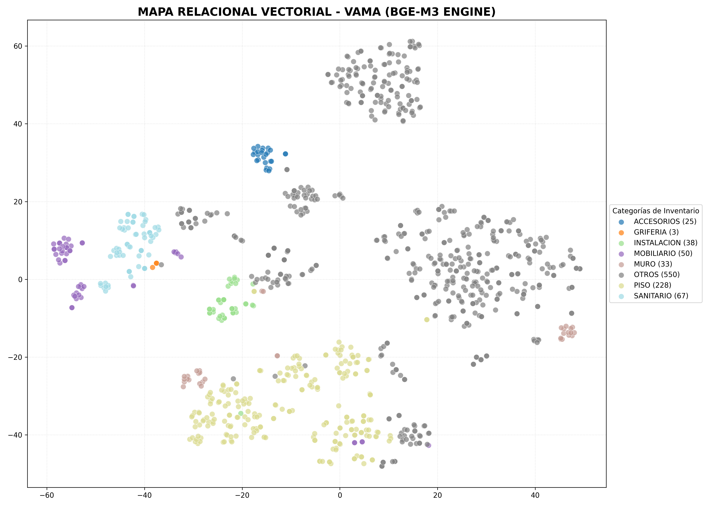

# VAMA RAG Engine - BGE-M3 Edition 🚀

Sistema de consulta inteligente de inventario basado en **Arquitectura RAG (Retrieval-Augmented Generation)**.

## 🧠 Características Técnicas
- **Embedding Engine:** BAAI/bge-m3 (Multilingual Massive Model).
- **Vector Database:** ChromaDB con métrica de distancia Coseno.
- **LLM Local:** Qwen 2.5 / Llama 3 vía Ollama.
- **Data Pipeline:** ETL de normalización de precios y clasificación semántica.

## 📊 Mapa Relacional Vectorial
El sistema organiza el inventario en un espacio latente de alta dimensionalidad. A continuación, la proyección del catálogo:

## 🚀 Instalación
1. Clonar el repo.
2. `pip install -r requirements.txt`
3. Colocar CSVs en `/data`.
4. Ejecutar `python3 ingest_tiles_catalog.py`.